# Commit for Good — Team Kernel Panic

> Flood-Ready Access helps disaster-response planners evaluate road-network failures in Cachar, Assam, and route emergency medical supplies across the damaged network using an access-aware integer programme.

This repository is the open-source submission of Team Kernel Panic for COMMIT FOR GOOD. Generated scenarios and simulated results are labelled as such; they should not be interpreted as measured real-world outcomes.

**Live demo:** <https://commit-for-good-kernel-panic.vercel.app> (the Brief and Evidence pages, and the Calculator running the Python engine).

## Contents

1. [About the hackathon](#about-the-hackathon)
2. [The problem](#the-problem)
3. [What this does](#what-this-does)
4. [Example](#example)
5. [How it works](#how-it-works)
6. [Data](#data)
7. [Run it, step by step](#run-it-step-by-step)
8. [Web app](#web-app)
9. [System architecture](#system-architecture)
10. [Deploy to Vercel](#deploy-to-vercel)
11. [Evaluation](#evaluation)
12. [Limitations](#limitations)
13. [Project layout](#project-layout)
14. [Contributing](#contributing)
15. [Team](#team) and [Licence](#licence)

## About the hackathon

COMMIT FOR GOOD is a three-day open-source hackathon on AI for public good. The challenge domain is **AI for Resilient and Sustainable Supply Chains**. Participants identify a specific real-world problem in the domain, show evidence that it matters, build an AI-powered open-source prototype, and release it.

## The problem

Disaster response planners and health officials cannot efficiently deploy limited emergency medical supplies and vehicles because they lack real-time visibility into which roads are cut and how catchment populations dynamically shift to surviving facilities. This can cause delivery waste, stockouts at newly overwhelmed facilities, and stranded populations left without care.

Disaster-response logistics can rely on pre-flood proportional allocation or a "blind" nearest-first approach. These methods do not account for the physical reality of the damaged network and may send trucks to facilities that are unreachable while reachable ones run dry. Press and abstract-level figures documenting this vulnerability during extreme weather events in Assam are secondary evidence; see our Brief for the full context.

The idea in one picture:

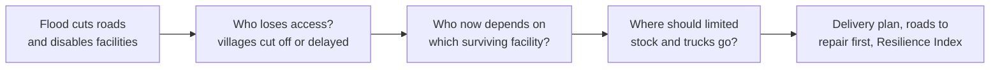

Why a blind allocation goes wrong, and what the access-aware one changes:

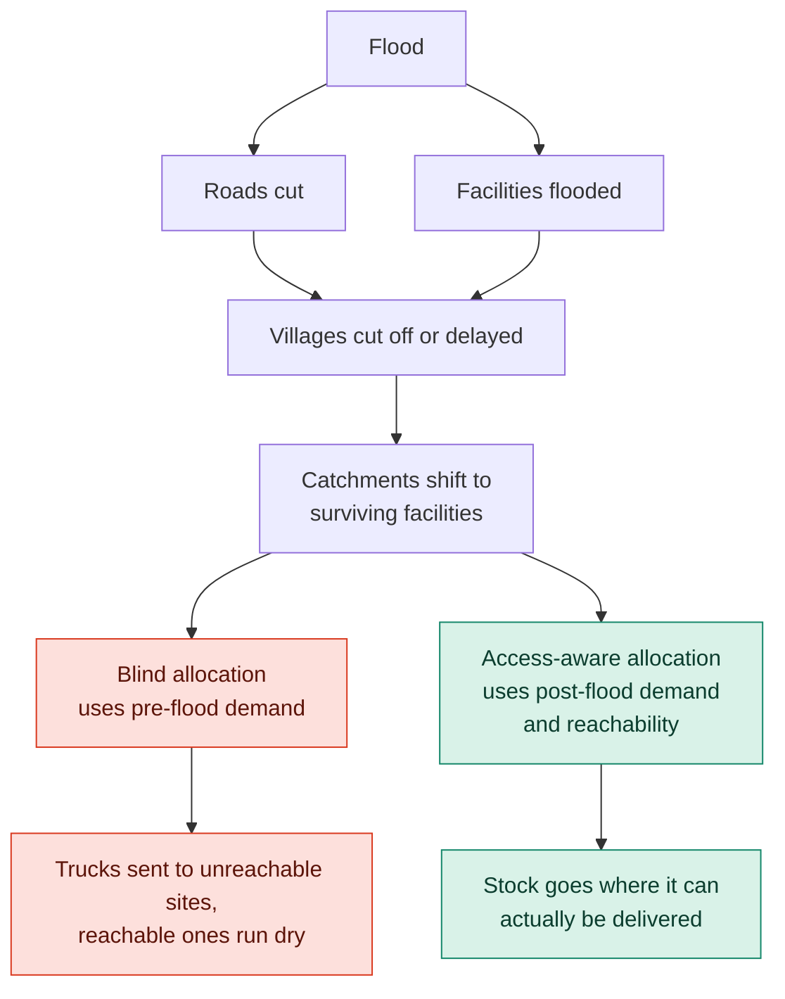

## What this does

**Input:** A district road network with habitation populations and health facilities (real open data from Cachar), a flood scenario dictating cut road segments (generated), and a logistics budget of available trucks, hours, and depot stock (generated).

**Output:** An access-loss assessment detailing cut-off villages, a truck-level delivery schedule optimising for unmet demand using an access-aware integer programme, and a ranked list of the most critical road segments to repair first.

Which inputs are real and which are generated:

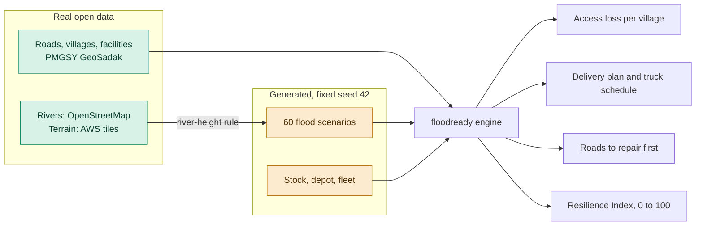

## Example

Running the following command simulates a severe flood scenario and allocates stock using a four-truck fleet:

```bash
python -m floodready demo --scenario severe_11 --trucks 4
```

Abridged output from the generated scenario (the real output is longer and prints the method comparison as a table):

```text
3. WHO LOSES ACCESS
   715,833 residents cut off (44.1%) in 556 villages | 723,682 delayed 30+ min | mean travel 11.6 -> 15.8 min

5. METHOD COMPARISON (unmet demand over 14 days, units)
   do nothing 7,846 | proportional 5,199 | nearest-first (blind) 6,455 | access-aware optimiser 5,103
```

These are simulated scenario outputs, not measurements from an actual flood.

## How it works

The engine builds a routable graph from road lines and simulates flood cuts using a parametric river-height rule. It runs a multi-source Dijkstra algorithm to assess access loss, then uses a SciPy HiGHS integer programme (a 0/1 multi-constraint knapsack) to allocate depot stock to reachable facilities, constrained by a strict truck-hour budget. See [docs/ARCHITECTURE.md](docs/ARCHITECTURE.md) for the complete system diagram and detailed model breakdowns.

**From road lines to a delivery plan**

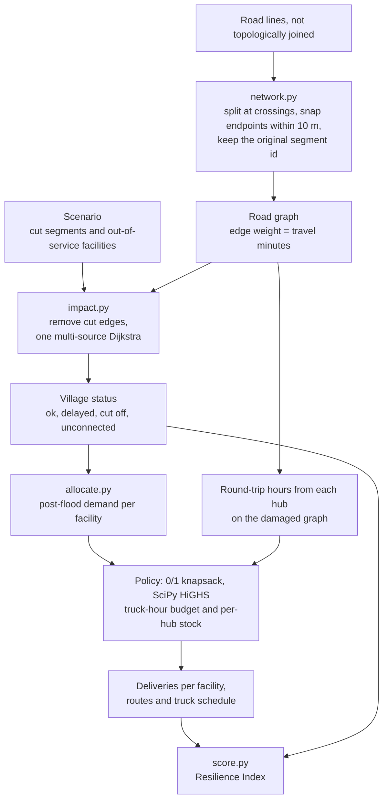

**What happens to each village.** A village is "cut off" if it could reach a working facility before the flood and cannot after it, and "delayed" if its travel time grows by 30 minutes or more. Villages that no facility could reach even without a flood are reported separately as "unconnected", because that is a data gap and not flood damage.

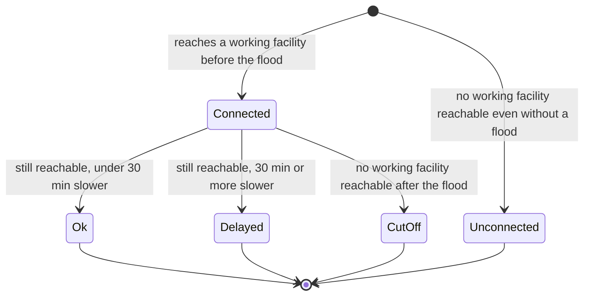

**How a generated flood decides what is cut.** The 60 presets, and any custom flood in the calculator, use the same rule, built from real rivers and terrain. It is a simplification of flood physics, not a hydraulic model.

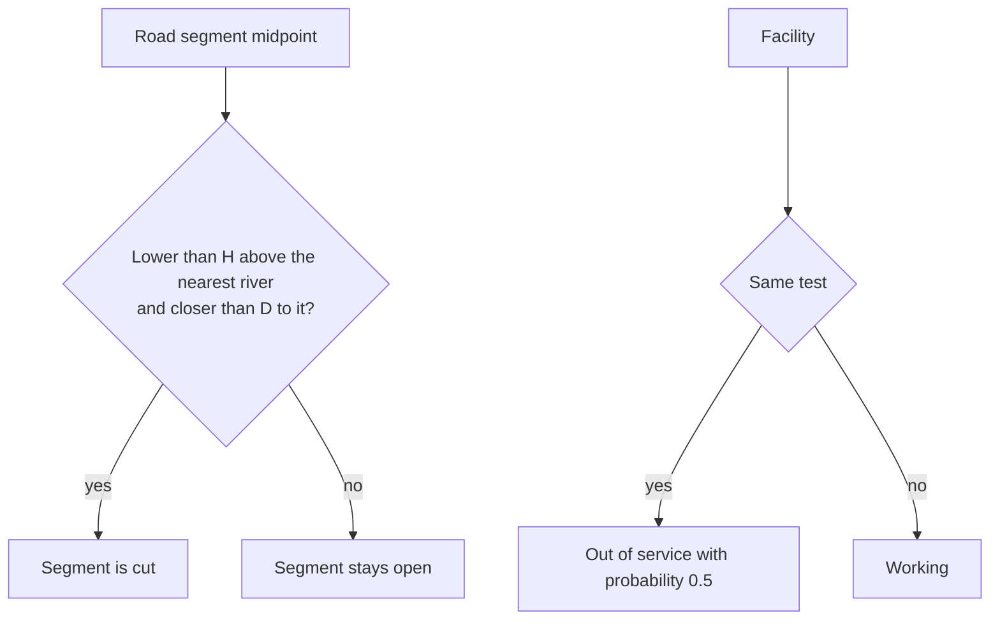

**Five allocation methods, chosen so each comparison isolates one idea.** Comparing the blind and informed versions measures the value of knowing the flood's effect. Comparing the informed version with the optimiser measures the value of optimising.

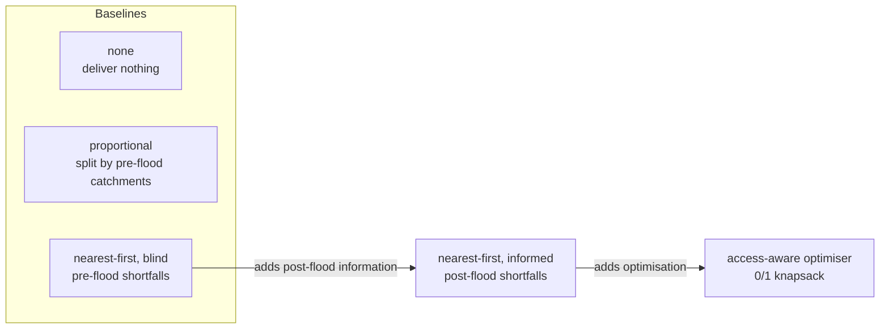

**Resilience Index.** One 0 to 100 number that summarises four things the model measures separately. The weights are a judgement, can be changed in the app, and the index has not been validated against real outcomes, so the four components are always shown beside it.

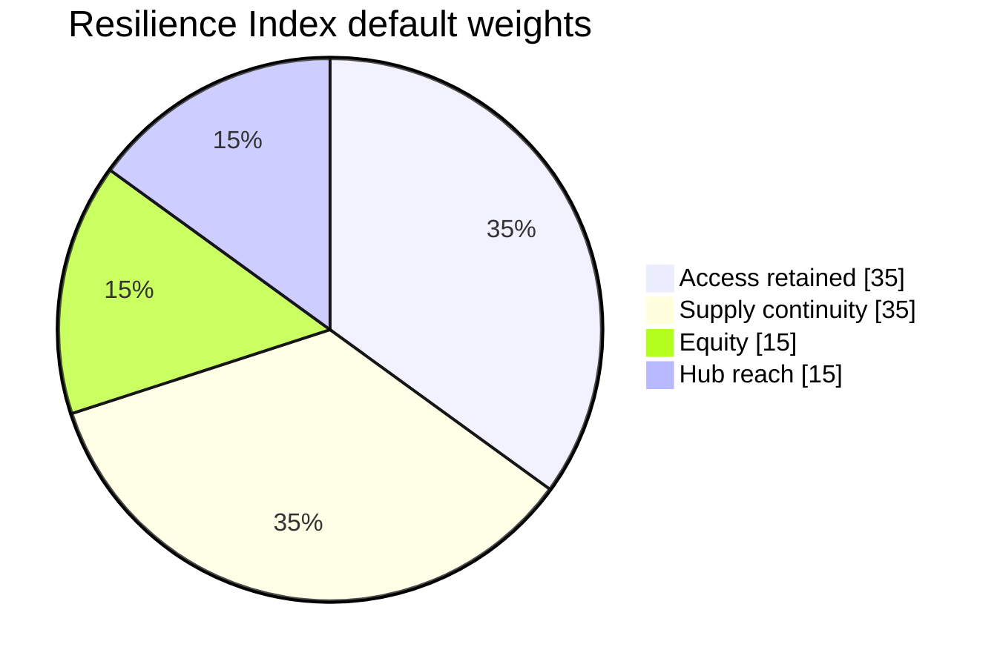

## Data

Real inputs are open data (PMGSY GeoSadak roads, habitations and facilities for Cachar, Assam; OpenStreetMap waterways; AWS terrain tiles). Stock levels, a depot, a vehicle fleet, and flood scenarios are **generated** and declared as such, with a fixed seed (42). Large raw downloads are not committed; `datasets/fetch_raw.py` fetches them. Sources, licences, and the audit are in [datasets/README.md](datasets/README.md) and [datasets/AUDIT.md](datasets/AUDIT.md); every synthetic parameter is in [datasets/synthetic/ASSUMPTIONS.md](datasets/synthetic/ASSUMPTIONS.md). Results on generated data demonstrate a method, not a measured real-world outcome.

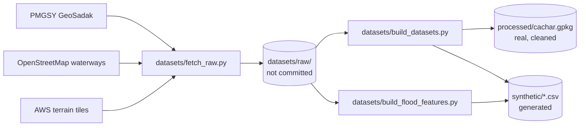

## Run it, step by step

Do the steps in this order. **Part A** is everything you need to see the project working and takes about ten minutes. Parts B and C are optional: they regenerate results and data that are already committed.

**You need:** [Git](https://git-scm.com/), [Python 3.13](https://www.python.org/downloads/) (the pinned versions in `requirements.txt` were developed on it) and [Node.js 20 or newer](https://nodejs.org/). Check them with `git --version`, `python --version` and `node --version`.

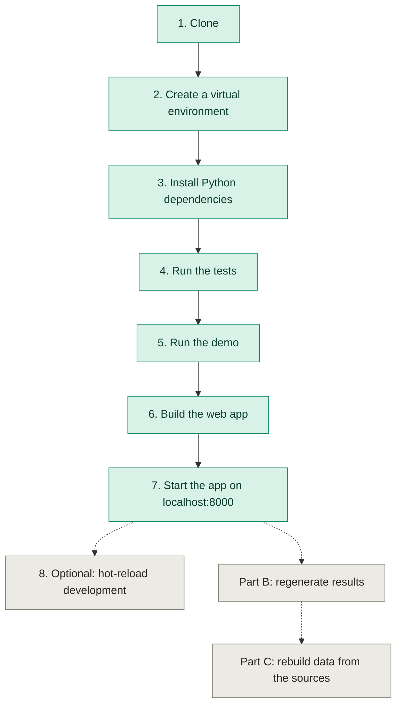

### Part A. Run the project

**1. Clone the repository**

```bash
git clone https://github.com/chiragshah2357/Commit-for-Good---Kernel-Panic.git
cd Commit-for-Good---Kernel-Panic
```

**2. Create and activate a virtual environment**

```bash
python -m venv .venv
```

Then activate it. Use the line for your shell:

```bash
source .venv/bin/activate          # macOS and Linux
source .venv/Scripts/activate      # Git Bash on Windows
```

```powershell
.venv\Scripts\Activate.ps1         # PowerShell on Windows
```

Your prompt should now start with `(.venv)`.

**3. Install the Python dependencies**

```bash
pip install -r requirements.txt
```

This installs the geospatial and scientific stack (about 650 MB) and takes a few minutes. The cleaned Cachar data (`datasets/processed/`) and the generated scenarios (`datasets/synthetic/`) are committed, so nothing else needs downloading.

**4. Check the install by running the tests**

```bash
pytest
```

Expected: `44 passed`.

**5. See the engine work**

```bash
python -m floodready demo --scenario severe_11 --trucks 4
```

Expected: a walk-through ending with the "WHO LOSES ACCESS" and "METHOD COMPARISON" sections shown in the [Example](#example) above. Add `--map results/demo_map.png` to also draw a map.

**6. Build the web app**

```bash
cd web
npm install
npm run build
cd ..
```

This type-checks the TypeScript and writes the site to `web/dist/`.

**7. Start the app**

```bash
python -m floodready serve
```

Open <http://localhost:8000>. The same process serves the built site and the API. The Calculator header should show **API online**; you can also open <http://localhost:8000/api/health>, which returns `{"ok":true,...}`. Interactive API docs are at <http://localhost:8000/docs>. Stop the server with `Ctrl+C`.

**8. Optional: develop with hot reload**

Keep the server from step 7 running, and in a second terminal:

```bash
cd web
npm run dev
```

Open <http://localhost:5173>. Vite reloads on every edit and proxies `/api` to port 8000, so the Calculator works the same way.

### Part B. Optional: regenerate the results

The results in `results/` and the files in `web/public/data/` are already committed. Run these, in this order, only if you changed the engine and want to refresh them.

```bash
python -m floodready profile     # 1. data profile: what was ingested, how clean it is, access before any flood
python -m floodready evaluate    # 2. 60 floods x 5 methods x 3 depot setups x 3 fleet sizes, statistics (about 3 min)
python -m floodready report      # 3. figures in results/figures/ and results/METRICS.md
```

`evaluate` needs `profile` first; `report` needs `evaluate` first. Everything is seeded, so on an unchanged engine these commands reproduce the committed files exactly (on Windows, Git may still list them as modified because of line endings; the content is identical). If you also changed what the web app shows, run `python -m floodready export` next (it needs the raw downloads from Part C, otherwise the map loses its rivers), then repeat steps 6 and 7.

### Part C. Optional: rebuild the data from the open sources

```bash
python datasets/fetch_raw.py                 # 1. download the raw open datasets into datasets/raw/ (not committed)
python datasets/build_datasets.py            # 2. cleaned real data and the generated stock, depot, fleet and 60 floods
python datasets/build_flood_features.py      # 3. per-segment river distance and height, for floods of any height in the app
```

Then repeat Part B, run `python -m floodready export`, and repeat steps 6 and 7 of Part A.

### All commands at a glance

| Command | What it does |
|---|---|
| `python -m floodready profile` | Data profile: inputs, data quality, and access before a flood |
| `python -m floodready evaluate` | The full evaluation (about 3 min) |
| `python -m floodready report` | Figures and `results/METRICS.md` |
| `python -m floodready demo --scenario severe_11 --trucks 4 --map results/demo_map.png` | One-scenario walkthrough, with a map |
| `python -m floodready export` | Rewrite `web/public/data/*.json` from `results/` |
| `python -m floodready serve` | API and built web app at <http://localhost:8000> |
| `pytest` | The 44 tests |

## Web app

A React + TypeScript interface over the same engine is in [web/](web/):

- **Brief (landing page):** A scroll-driven map of Cachar in which a simulated flood cuts the roads and villages lose access.
- **Evidence:** The Round 1 brief in full (tables, sources, AI declaration), with interactive figures, the data profile, the method and formulas, and results with confidence intervals, paired tests, and robustness checks.
- **Calculator:** Pick any of the 60 generated floods, draw your own by clicking roads, raise a river, or upload segment IDs; place hubs; set the fleet and method. It reports who loses access, compares the five methods (and replays the setup on all 60 floods), plans deliveries and truck schedules, ranks roads to repair, shows where more trucks stop helping, and gives a 0–100 Resilience Index whose formula and weights are shown on screen. Every figure is stamped real, generated, or computed.
- **Presenter mode (`Shift+P`):** Steps through the five-minute talk track in [docs/DEMO_SCRIPT.md](docs/DEMO_SCRIPT.md); press `N` to show notes.

The Evidence and Brief pages read static JSON and work without the API; the Calculator needs the Python API (step 7 above).

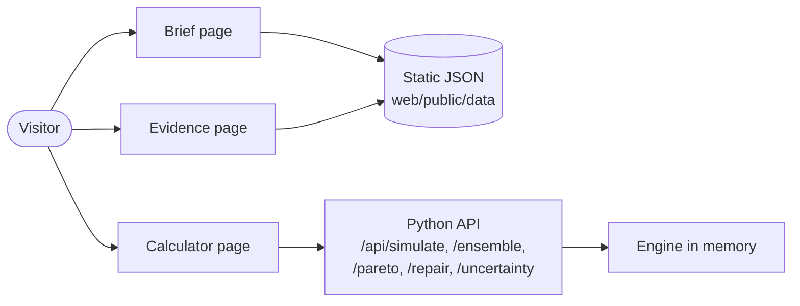

## System architecture

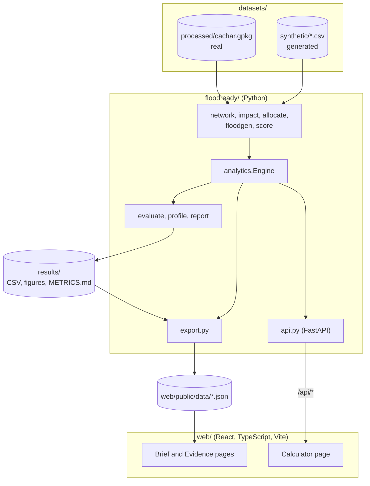

What happens when someone uses the Calculator:

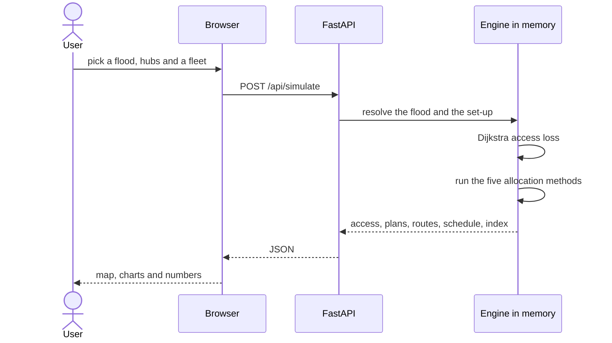

The full module-by-module description, the integer programme written out, and the design decisions are in [docs/ARCHITECTURE.md](docs/ARCHITECTURE.md).

## Deploy to Vercel

The whole app (static pages and the Python API) deploys as one Vercel project using [Vercel Services](https://vercel.com/docs/services). [`vercel.json`](vercel.json) defines the two services and the routes: `/api/*` goes to the FastAPI service and everything else to the web app. Full notes are in [docs/DEPLOY.md](docs/DEPLOY.md).

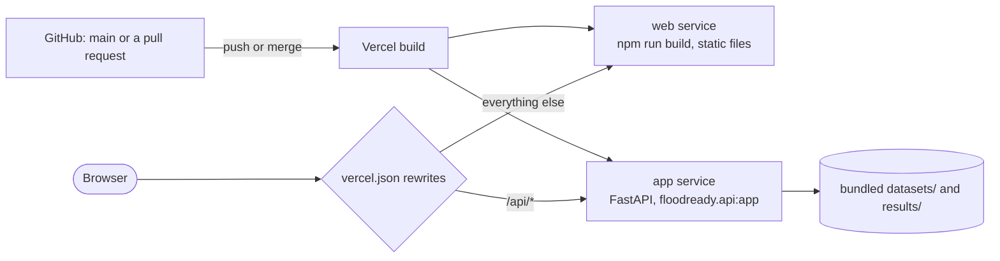

**Steps, in order**

1. Merge your work into `main` (the production deployment follows `main`).
2. In [Vercel](https://vercel.com/new), choose **Add New → Project** and import this GitHub repository.
3. Keep the detected settings: Application Preset **Services** and Root Directory `./`. No environment variables are needed.
4. Click **Deploy**, and wait for the build to finish.
5. Open the production domain and check `/api/health`; it should return `{"ok":true,...}`. Then open the Calculator and confirm it says **API online**.

**Good to know**

- Production is public at <https://commit-for-good-kernel-panic.vercel.app>. Preview deployments (one per pull request) sit behind Vercel's login, so you will be redirected to sign in; that is expected.
- A pull request whose branch was created **before** `vercel.json` landed in `main` has no Vercel configuration, so its preview fails. Fix it by updating the branch with `main` (the **Update branch** button on the pull request, or `git merge origin/main`).
- Only the packages the API needs at run time are installed on Vercel (see `pyproject.toml`); `requirements.txt` is for local development, the data pipeline and the tests.

## Evaluation

Each of 60 generated floods (20 each of mild, moderate, and severe) is assessed for loss of access; stock is then allocated by five methods under three depot setups and three fleet sizes. Metrics include residents cut off and delayed, travel time, unmet demand, share of avoidable unmet demand captured, delivery waste, equity of unmet demand, and truck-hours. Statistics include bootstrap confidence intervals, paired tests, hub choice validated on held-out floods, sensitivity sweeps, robustness to missing roads, and validation checks. Full tables: [results/METRICS.md](results/METRICS.md).

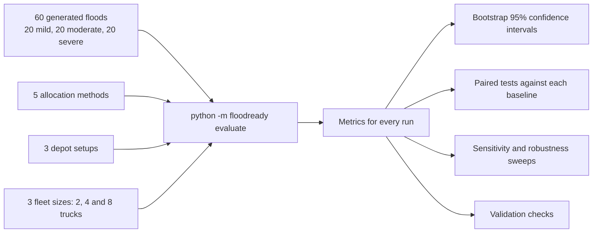

Hubs are chosen on one half of the floods and judged on the other half, so the hub result is not fitted to the floods it is tested on:

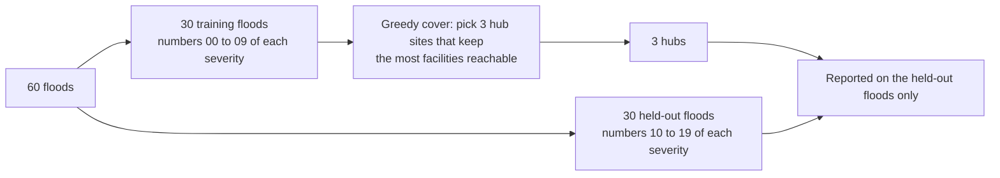

On the generated evaluation set, the reported headline findings are:

- Using post-flood information (who each facility now serves and what is reachable) removes most avoidable unmet demand; an optimiser adds value only when trucks are scarce.
- A single depot is isolated in two thirds of held-out floods; three pre-positioned hubs reduce that to 10% (72% of facilities reachable against 45%).
- What remains unmet is mostly unreachable by road, which points to pre-positioning stock at facilities and to non-road access.

## Limitations

Stock, demand, depot, fleet, and flood extents are **generated** (seed 42), so results show how the method behaves under stated assumptions and are not findings about a real flood. Road data is a July 2022 snapshot; travel speeds are assumed; health facilities are identified by name only; 11 facilities serve no village on a travel-time basis. See [datasets/synthetic/ASSUMPTIONS.md](datasets/synthetic/ASSUMPTIONS.md) and [datasets/AUDIT.md](datasets/AUDIT.md).

## Project layout

```text
floodready/   network.py (road graph), impact.py (access loss), allocate.py (methods), evaluate.py, profile.py, report.py, demo.py
              analytics.py (what-if engine), api.py (FastAPI), floodgen.py (parametric floods), score.py (Resilience Index), export.py
web/          React + TypeScript app: src/pages (Landing, Evidence, calculator), src/components, public/data (static JSON)
datasets/     raw (ignored), processed (real, cleaned), synthetic (generated), audit, build and fetch scripts
results/      CSV outputs, METRICS.md, figures/
tests/        44 tests
docs/         DEMO_SCRIPT.md, ARCHITECTURE.md, DEPLOY.md
vercel.json   Vercel Services configuration (web app and API)
```

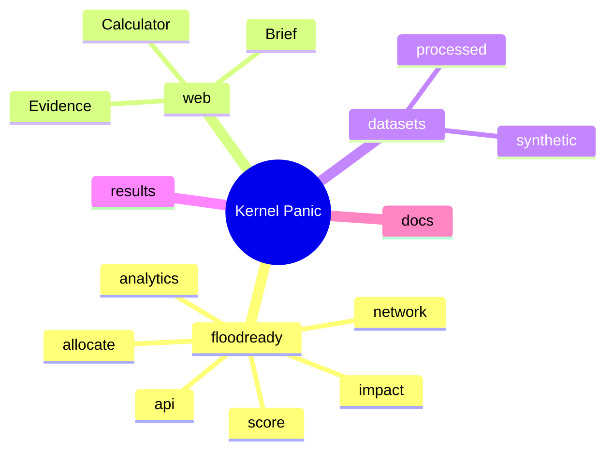

## Contributing

Contributions are welcome. See [CONTRIBUTING.md](CONTRIBUTING.md) for setup, the branching convention, and how to propose a change. Good places to start are issues labelled `good first issue`.

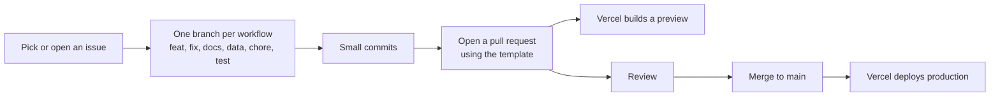

## Team

Team Kernel Panic: Chirag ([@chiragshah2357](https://github.com/chiragshah2357)) and Augustya ([@AugustyaSingh](https://github.com/AugustyaSingh)).

## Licence

MIT. See [LICENSE](LICENSE). Third-party data, code, and models keep their own licences; see [ACKNOWLEDGEMENTS.md](ACKNOWLEDGEMENTS.md).
