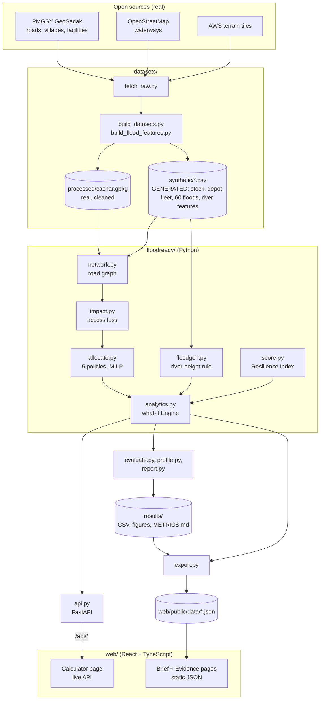

# Architecture

How Flood-Ready Access is put together: what each part does, the models behind the numbers, how data moves from open
sources to the web calculator, and where the design is deliberately simple. Everything described here is in this
repository; file names are relative to the repository root.

**Reading the numbers.** Roads, villages and health facilities are real open data. Floods, stock levels, the depot and the
fleet are **generated** (seed 42, [assumptions](../datasets/synthetic/ASSUMPTIONS.md)). Every result is therefore a method
result on a simulated flood under stated assumptions, not a measured outcome in Cachar.

## 1. What the system does

Given a flood (one of 60 generated, a hand-drawn set of cut roads, or a river-height rule), the system answers four
questions for Cachar district, Assam:

1. **Who loses access?** Which villages can no longer reach a working health facility by road, and who is merely delayed.
2. **What should be delivered where?** Which facilities a limited fleet should visit with depot stock, compared with four simpler policies.
3. **What would change the answer?** Which cut road to repair first, where more trucks stop helping, and how far the answer moves if real roads are missing from the data.
4. **How bad is it overall?** A 0-100 Resilience Index whose formula and weights are always on screen, next to its four components.

## 2. System overview



Two paths feed the web app. The **Brief** and **Evidence** pages read static JSON exported from the engine and the
results files, so they work with no server. The **Calculator** calls the Python API, which runs the same engine live.
The pre-computed results and the live calculator use the same code, so they agree by construction; a test checks that the
exported JSON matches the engine (`tests/test_export.py`).

## 3. Data layer

| Item | Origin | Where |
|---|---|---|
| Road lines (category, owner), habitation points with population, health-facility points | **Real**: PMGSY GeoSadak, July 2022 snapshot, via the datameet mirror | `datasets/processed/cachar.gpkg` (layers `roads`, `habitations`, `health_facilities`) |
| Rivers | **Real**: OpenStreetMap waterways | `datasets/raw/` (not committed; `fetch_raw.py`) |
| Terrain height | **Real**: AWS terrain tiles | `datasets/raw/` (not committed) |
| Height above and distance to the nearest river, for every road segment and facility | Computed from the two rows above | `datasets/synthetic/flood_features.csv` (`build_flood_features.py`) |
| Facility stock and demand, depot, fleet | **Generated** | `datasets/synthetic/facilities_stock.csv`, `depot.csv`, `fleet.csv` |
| 60 flood scenarios (20 each of mild, moderate, severe) | **Generated** from the real river and terrain features | `datasets/synthetic/flood_scenarios.csv`, `scenario_summary.csv` |

Cleaning removed 119 entries marked "Medical" and 32 veterinary entries from the facility layer, leaving 87 human-health
facilities; the audit scripts are in `datasets/audit/` and the findings in [datasets/AUDIT.md](../datasets/AUDIT.md).
Raw downloads are not committed (`datasets/fetch_raw.py` fetches them); the cleaned and generated files are, so the
engine runs without downloading anything.

## 4. The engine (`floodready/`)

| Module | Responsibility |
|---|---|
| `network.py` | Builds a routable road graph from road lines that are **not** topologically joined: splits lines at crossings and T-junctions, merges endpoints within 10 m into nodes, keeps the original segment id on every edge, and attaches villages, facilities and the depot to their nearest node (`load_cachar`). |
| `scenarios.py` | `Scenario` (a set of cut road segments and a set of out-of-service facilities) and the loader for the 60 generated floods. |
| `impact.py` | Access-loss assessment: per village, travel time to the nearest working facility before and after a flood. |
| `allocate.py` | Five stock-allocation policies, including the integer programme; truck-hour accounting. |
| `floodgen.py` | The river-height rule that generated the 60 floods, applicable to any height and distance, plus hand-drawn floods. |
| `score.py` | The Resilience Index: components, weights, formula text. |
| `metrics.py` | Gini, bootstrap confidence intervals, paired comparison with Wilcoxon test, weighted quantiles. |
| `analytics.py` | `Engine`: the what-if layer used by the API. `simulate`, `ensemble`, `pareto`, `repair`, `uncertainty`, routes, truck schedule. |
| `evaluate.py` | The full evaluation behind `results/`: 60 floods x 5 methods x 3 depot setups x 3 fleet sizes, statistics, hub selection, sensitivity and robustness sweeps, validation checks. |
| `profile.py`, `report.py` | The data profile, figures (`results/figures/`) and `results/METRICS.md`. |
| `export.py` | Writes `web/public/data/{geometry,scenarios,evidence}.json` for the static pages. |
| `api.py` | FastAPI app: request validation and the endpoints in section 7. |
| `demo.py`, `__main__.py` | Command-line entry points: `profile`, `evaluate`, `report`, `export`, `serve`, `demo`. |

## 5. The models

### 5.1 Road graph and access (`network.py`, `impact.py`)

- The graph is undirected; an edge's weight is travel minutes = length / speed, where speed is assumed per road category
  (NH 50, SH 40, MDR 30, RR(ODR) 25, RR(VR) 20, BR 20, RR(TRACK) 10 km/h; no measured speeds exist).
- A flood **cuts whole original road segments**: the graph matrix is rebuilt with every edge of those segments removed.
  This is why each edge keeps its original `seg_id`.
- A village or facility is attached to its nearest graph node, with an access leg at an assumed 10 km/h.
- Travel time to the nearest working facility is one **multi-source Dijkstra** (`scipy.sparse.csgraph.dijkstra`,
  `min_only=True`) started from all working facilities at once, so assessing a flood is one shortest-path run, not one per village.
- A village is **cut off** if it could reach a facility before the flood and cannot after; **delayed** if its travel time
  grows by 30 minutes or more (adjustable in the app); **unconnected** if it could not reach any facility even without a
  flood. Unconnected villages are reported separately, because that is a data gap and not flood damage.

### 5.2 Stock allocation (`allocate.py`)

Demand of a facility = residents it serves x 0.002 courses per person per day x 14 days. Unmet demand = what its stock plus
deliveries cannot cover. Deliveries leave from one depot or several hubs within a 3-day window. Each served facility gets one
dedicated round trip whose hours are computed on the **damaged** graph:

```
trip hours  =  2 x (minutes from the serving hub / 60)  +  0.5 service hours
truck-hour budget  =  trucks x 10 hours/day x 3 days
```

The five policies, chosen so that each comparison isolates one idea:

| Policy | What it does | What the comparison shows |
|---|---|---|
| `none` | Delivers nothing | The cost of doing nothing |
| `proportional` | Splits depot stock by **pre-flood** catchment population | A common, simple rule |
| `nearest_first` | Fills **pre-flood** shortfalls, nearest facility first | A plausible rule that does not see the flood's effect on who each facility serves |
| `nearest_first_post` | Same, but on **post-flood** shortfalls | `nearest_first` vs this = the value of **information** |
| `access_opt` | Integer programme on post-flood shortfalls and travel times | `nearest_first_post` vs this = the value of **optimisation** |

The integer programme (`scipy.optimize.milp`, HiGHS) is a 0/1 multi-constraint knapsack. With `x_i` = 1 if facility `i` is
visited, `u_i = min(post-flood shortfall_i, 3000)` (truck capacity) and `h_i` the trip hours:

```
maximise    sum_i  u_i x_i                       useful units delivered
subject to  sum_i  h_i x_i        <=  trucks x 10 x 3       truck-hours
            sum_{i served by hub k} u_i x_i  <=  hub k stock     for every hub k
            x_i in {0, 1}
```

Only facilities that are working and reachable on the damaged graph can be chosen. Stock is split equally between hubs.
**This is not a vehicle-routing problem**: every visit is a dedicated out-and-back trip. Multi-drop routing would shorten
the trucks' time and is a listed improvement (section 10).

### 5.3 Hubs (`evaluate.py: hub_analysis`)

Hub sites are chosen by a greedy cover on the training floods: each step adds the candidate node (the graph node nearest to a facility, in the main network) that keeps the most additional (scenario, facility) pairs reachable. Floods 00-09 of each severity are
training and 10-19 are held out; results for hubs are reported on the held-out floods. On the held-out floods, three hubs
leave 72% of facilities reachable against 45% for the single Silchar depot, and a single depot is isolated (under half the
facilities reachable) in 67% of floods against 10% with three hubs.

### 5.4 Parametric flood (`floodgen.py`)

A road segment is cut if its midpoint is **lower than `height_m` above the nearest river point and within `distance_m` of it**.
A facility meeting the same test is out of service with probability 0.5 (seeded). The 60 presets used this rule with
severity-specific parameters (mild 1.0 m / 150 m, moderate 2.5 m / 600 m, severe 4.5 m / 1,500 m, with random jitter), so a
custom flood in the calculator is consistent with them. It is a simplification of flood physics, not a hydraulic model, and
the severities are not calibrated to any real event.

### 5.5 Resilience Index (`score.py`)

```
RI = 100 x ( 0.35 A + 0.35 S + 0.15 E + 0.15 R )
```

| Component | Meaning |
|---|---|
| A, access retained | share of connected residents neither cut off nor delayed |
| S, supply continuity | share of 14-day demand met; demand in cut-off villages counts as unmet |
| E, equity | share of working facilities **not** left more than 25% short of their post-flood demand |
| R, hub reach | share of working facilities a hub can still reach by road |

The weights are a judgement, can be changed in the app, and are not estimated from data. The index is a decision-support
summary for comparing options on the same flood; it has not been validated against real outcomes, which is why the four
components are always shown beside it. Bands: robust 80+, strained 60+, degraded 40+, failing below.

### 5.6 What-if analytics (`analytics.py`)

| Analysis | Method |
|---|---|
| `simulate` | One flood, one set-up: access assessment, all five policies, per-facility deliveries, routes drawn along real road shapes, and a greedy truck schedule (longest trip first onto the least-loaded truck). The schedule is **one feasible packing**; the optimiser constrains total truck-hours, not individual truck days, and the schedule flags overflow. |
| `ensemble` | The same set-up replayed on all 60 floods: means with percentile bootstrap CIs (2,000 resamples, seed 42), the average of the worst 10% of floods (CVaR10), and paired comparisons with Wilcoxon p-values. |
| `pareto` | Unmet demand against fleet size (1 to 12 trucks) for the chosen flood and across all 60. The "knee" is the first fleet size after which one more truck lowers the 60-flood mean by less than 1% of the 1-truck value. |
| `repair` | Restores each cut segment alone (only those that could shorten a path), recomputes the multi-source Dijkstra, and ranks by residents regaining access, then person-minutes saved. |
| `uncertainty` | Removes a random share (default 20%) of **real** road segments as if missing from the data, re-runs the whole pipeline 24 times, and reports the 5th, 50th and 95th percentiles of the share cut off, unmet demand and the index. |

## 6. Evaluation design (`evaluate.py`, `results/`)

- **Scenarios:** 60 generated floods. **Baselines:** four simpler policies (above). **Fleets:** 2, 4 and 8 trucks. **Depots:** single, single resilient, three hubs.
- **Statistics:** bootstrap CIs; paired differences against each baseline over the same floods with win/tie rates and Wilcoxon signed-rank tests; hubs chosen on training floods and tested on held-out ones.
- **Sensitivity:** road-network joining tolerance (5, 10, 25 m), travel speed (+/-20%), depot stock, horizon, fleet and demand rate.
- **Robustness:** random removal of 5%, 10% and 20% of real roads, with overlap of the top-10 worst villages.
- **Validation checks:** road circuity (median 1.37, plausible 1 to 2); agreement between the nearest facility by road time and by straight line (70% of residents); conservation of residents assigned to facilities; cut-off share rises with severity (mild 3.2%, moderate 22.4%, severe 45.8%).
- **Output:** CSVs and 13 figures in `results/`, summarised in [results/METRICS.md](../results/METRICS.md), regenerated by `python -m floodready evaluate` then `report` (about 3 minutes).

Headline findings, with their limits: post-flood information removes most avoidable unmet demand, the optimiser adds value
only when trucks are scarce, and what remains unmet is mostly in villages or facilities no truck can reach by road. These
hold on generated floods and stock; they are not claims about a real flood.

## 7. API (`api.py`)

FastAPI, validated with pydantic. All `POST` bodies share one shape: `flood` (mode `preset` | `parametric` | `manual` and its
parameters), `setup` (trucks, hubs, stock, horizon, demand rate, policy, speed, delay threshold) and optional index `weights`.
Interactive documentation is served at `/docs`.

| Endpoint | Returns |
|---|---|
| `POST /api/simulate` | Access loss, all five policies, deliveries, routes, truck schedule, Resilience Index, decomposition of unmet demand |
| `POST /api/ensemble` | Means, CIs, CVaR10, paired tests over the 60 floods |
| `POST /api/pareto` | Unmet demand against fleet size and the knee |
| `POST /api/repair` | Roads to repair first |
| `POST /api/uncertainty` | Percentile band under missing roads (`missing_share`, `reps`) |
| `POST /api/flood/preview` | Size of a custom flood, without routing (fast) |
| `GET /api/meta`, `GET /api/health` | Presets, defaults, assumptions, index formula; liveness and load time |

Input limits are enforced at the boundary (for example 1,200 hand-drawn cut segments, 1 to 20 trucks, flood height up to
15 m). `Engine` loads the Cachar graph once at start-up (about 2 s) and caches per-speed graphs, the no-flood baseline, the
assessment of all 60 floods, and the last 8 ensemble and Pareto answers; writes are guarded by a lock. If `web/dist` exists,
the API also serves the built web app, so one process serves the whole product on one port.

## 8. Web app (`web/`)

React 19 + TypeScript + Vite; routing with `react-router-dom`; state with `zustand`; D3 for scales and shapes only, with
charts drawn as SVG by a small purpose-built kit.

| Part | Notes |
|---|---|
| `pages/Landing.tsx` | Scroll-driven map of Cachar: a flood cuts roads, villages lose access. Reads `geometry.json` and `scenarios.json`. |
| `pages/Evidence.tsx`, `pages/evidence/` | The Round 1 brief in full and the Round 2 build: data profile, method, results, limitations. Reads `evidence.json`. Every figure carries a provenance stamp: real, generated, computed or secondary. |
| `pages/calculator/` | Controls, a flood-and-hub map, and result panels. Calls the API through `lib/api.ts`; keeps set-up in one store. |
| `components/map/MapCanvas.tsx` | Canvas map with no map tiles: pan, zoom, pinch, hit-testing, click-to-cut roads, animated delivery routes. Drawn from the exported geometry. |
| `components/charts/kit.tsx` | The SVG chart kit (axes, intervals, bars, scatter) and tooltips. |
| `presenter/` | Presenter mode (`Shift+P`): guided steps following [DEMO_SCRIPT.md](DEMO_SCRIPT.md), with notes (`N`). |

The page contract: the static pages need nothing but the JSON files; only the Calculator needs the API. In development,
Vite proxies `/api` to `127.0.0.1:8000`.

## 9. Design decisions

| Decision | Reason | Cost |
|---|---|---|
| SciPy HiGHS `milp` instead of OR-Tools | One fewer heavy dependency; the problem as modelled is a 0/1 knapsack that HiGHS solves exactly in milliseconds. The Round 1 brief named OR-Tools; the change is declared on the Evidence page. | No multi-drop vehicle routing yet |
| Dedicated trips, not routes | Keeps the model transparent and the truck-hour accounting exact | Overstates truck-hours versus a good routing plan |
| Whole-segment cuts from a river-height rule | Reproducible, explainable, derived from real rivers and terrain | Not hydraulics; not calibrated to an event |
| Generated stock and flood extents, declared | No open source for facility stock or a dated vector flood layer was found | Results show method behaviour, not real outcomes |
| Static JSON for the evidence pages | Works with no server and loads fast | Needs `python -m floodready export` after results change |
| No map tiles | No third-party calls, no keys, works offline, stays on the editorial style | Less geographic context than a tile map |
| Fixed seed 42 everywhere | Every number in the repository can be regenerated | Single draw of the generated inputs |

## 10. Known limitations and extension points

- **Stock, demand, depot, fleet and flood extents are generated.** Replace `datasets/synthetic/` with real data of the same columns and the engine runs unchanged.
- **Roads only.** Boats and air access are not modelled. The fleet file contains two boats that the road model does not use.
- **11 facilities serve no village** on a travel-time basis. The generated stock used straight-line catchments, and for only 70% of residents is the nearest facility by road time also the nearest in a straight line; the rest are a known mismatch.
- **Resilience Index weights are a judgement**, and the index is unvalidated.
- **The depot-time cache in `allocate.py` (`_depot_cache`) has no eviction** apart from a reset in the uncertainty analysis; a long-running server answering many distinct custom floods will grow it.
- **Press and abstract-level figures** on the Evidence page are secondary evidence, to be checked against primary ASDMA and NHM documents.

Where contributions fit best: multi-drop routing (replace the dedicated-trip model in `allocate.py`), a dated inundation layer in
place of the river-height rule (`floodgen.py`), another district (everything is keyed to `cachar.gpkg` and the synthetic CSVs),
and boat access. See [CONTRIBUTING.md](../CONTRIBUTING.md).

## 11. Reproducing everything

```bash
pip install -r requirements.txt
python -m floodready profile && python -m floodready evaluate && python -m floodready report   # results/ (about 3 minutes)
python -m floodready export                 # web/public/data/*.json (rivers need the raw downloads)
pytest                                      # 44 tests
python -m floodready serve                  # API and built app on http://localhost:8000
cd web && npm install && npm run build      # Node 20+
```
